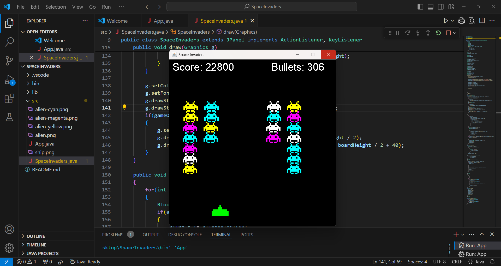
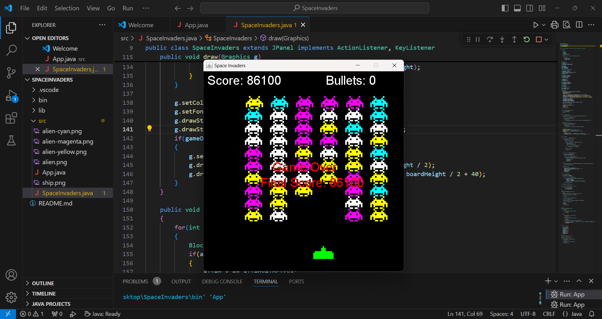

# Space Invaders Game

A modern take on the classic Space Invaders, developed in Java with Swing for an engaging graphical interface. This game challenges players to defend their ship against waves of advancing aliens while managing a finite number of bullets.

## Features

- **Intuitive Controls:** Navigate your spaceship using the left and right arrow keys.
- **Strategic Shooting:** Fire bullets with the space bar. Remember, you only have a limited supply!
- **Dynamic Alien Movement:** Aliens move horizontally across the screen, descending as they approach the player's ship.
- **Score Tracking:** Earn points by successfully hitting aliens. Your score is prominently displayed during gameplay.
- **Game Over Mechanics:** The game ends if you run out of bullets or if an alien reaches your position.
- **Restart Option:** After a game over, press Enter to reset the game and try again.

## Screenshots





## Controls

- **Left Arrow:** Move spaceship left
- **Right Arrow:** Move spaceship right
- **Space Bar:** Shoot bullets
- **Enter:** Restart the game after it's over

## Getting Started

### Prerequisites

- **Java Development Kit (JDK):** Ensure you have Java installed on your machine. You can download it [here](https://www.oracle.com/java/technologies/javase-downloads.html).

### Installation

1. **Clone the Repository:**

   ```bash
   git clone https://github.com/your-username/SpaceInvaders.git
    ```

2. **Run**

    ```bash
    javac App.java
    java App
    ```